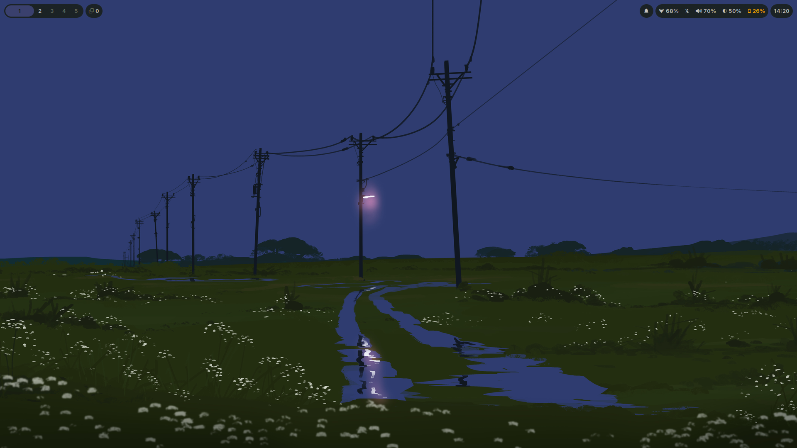
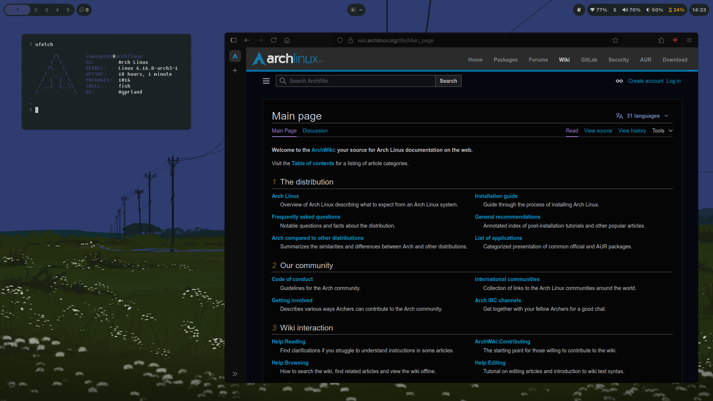

# Hyprland Rice
This repository contains my personal Hyprland rice (configuration) to get a sleek and functional environment.
# Screenshots


# Dependencies
Before using this configuration, make sure to install the following dependencies.

Official Repository Dependencies
```bash
sudo pacman -S hyprland waybar foot nautilus fuzzel swaync swww cliphist bluez bluez-obex dina-font pavucontrol ttf-jetbrains-mono-nerd fish starship pacman-contrib grim slurp brightnessctl hyprpicker
```
# AUR Dependencies
The following packages are available only in the AUR, so you'll need an AUR helper like yay (or paru, trizen, etc.) to install them. 
1. Install yay if you don't have it yet:

```bash
sudo pacman -S --needed git base-devel
git clone https://aur.archlinux.org/yay.git
cd yay
makepkg -si
```
2. Then, install the AUR packages:
```bash
yay -S librewolf-bin bluetuith python-pywal16 bibata-cursor-theme-bin
```
# Configuration
This is the configuration I use for Hyprland, Waybar, and some other applications. Feel free to modify it to suit your needs.
# Monitor setup
Configure your monitors using the monitor command. In this setup:

  - eDP-1 is the built-in laptop screen (1080p).

  - HDMI-A-1 is an external display, set to mirror the laptop screen.
```bash
monitor = eDP-1, 1920x1080@60, 0x0, 1
monitor = HDMI-A-1, 1920x1080@60, auto, 1, mirror, eDP-1
```
# Environment Variables
Set various environment variables for better compatibility and performance.
```bash
env = XCURSOR_THEME,Bibata-Modern-Classic
env = XCURSOR_SIZE,22
env = HYPRCURSOR_SIZE,22
env = XDG_CURRENT_DESKTOP,Hyprland
env = XDG_SESSION_TYPE,wayland
env = XDG_SESSION_DESKTOP,Hyprland
env = QT_QPA_PLATFORM,wayland;xcb
env = QT_WAYLAND_DISABLE_WINDOWDECORATION,1
env = QT_QPA_PLATFORMTHEME,qt6ct
env = ELECTRON_OZONE_PLATFORM_HINT,auto
```
# Autostart Programs
This section autostarts essential processes such as Waybar, notifications, and background services:
```bash
exec-once = waybar
exec-once = hypridle
exec-once = swaync
exec-once = wl-paste --watch cliphist store
exec-once = swww-daemon
exec-once = swww img '$HOME/Pictures/Wallpapers/Volkswagen Van.jpg'
```
# Keybindings
Here are the keybindings used in this configuration:

| Keybind                  | Action                                 |
| ------------------------ | -------------------------------------- |
| `Super + Shift + Return` | Open terminal (`foot`)                 |
| `Super + Shift + C`      | Kill active window                     |
| `Super + Shift + Q`      | Exit session                           |
| `Super + E`              | Open file manager (`nautilus`)         |
| `Super + W`              | Open browser (`librewolf`)             |
| `Super + Space`          | Toggle floating window                 |
| `Super + R`              | Open menu (`fuzzel`)                   |
| `Super + P`              | Switch to dwindle layout               |
| `Super + J`              | Toggle split layout                    |
| `Super + L`              | Lock screen (`hyprlock`)               |
| `Super + C`              | Open color picker (`hyprpicker`)       |
| `Super + Arrow Keys`     | Move focus between windows             |
| `Super + [0-9]`          | Switch to workspace \[1-10]            |
| `Super + Shift + [0-9]`  | Move window to workspace \[1-10]       |
| `Super + S`              | Toggle special workspace (scratchpad)  |
| `Super + Mouse Scroll`   | Switch workspaces with mouse scroll    |
| `Super + LMB/RMB`        | Move/resize windows with mouse         |
| `Super + Tab`            | Cycle through windows in floating mode |

# Window Rules
The following rules are applied to certain windows to ensure they open as floating or are ignored by certain effects.
```bash
windowrule = float, class:foot
windowrule = float, class:imv
windowrule = float, class:mpv
windowrule = float, class:protonvpn-app
windowrule = float, class:org.pulseaudio.pavucontrol
windowrule = float, class:org.gnome.FileRoller
windowrule = float, class:librewolf, title:About LibreWolf
```
